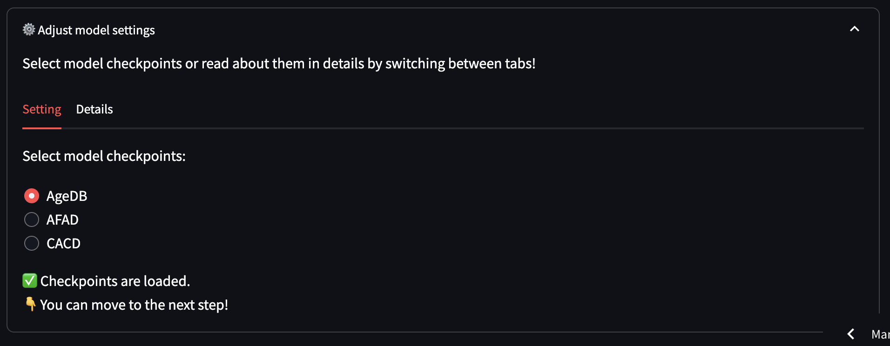
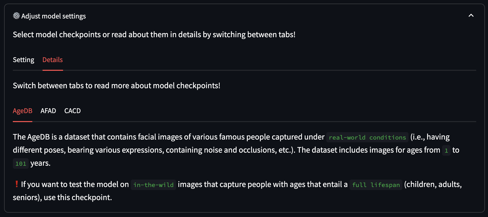
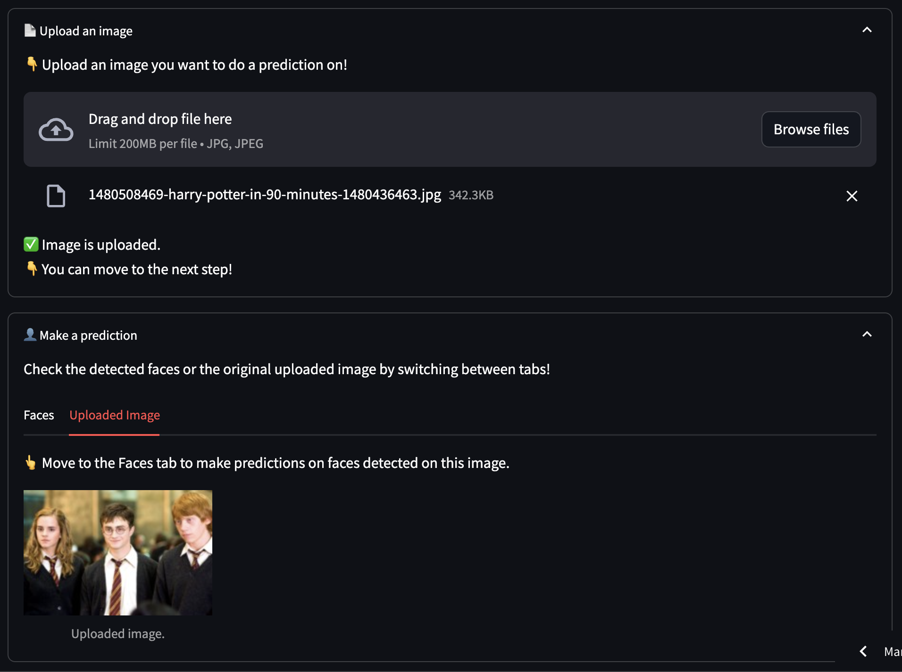
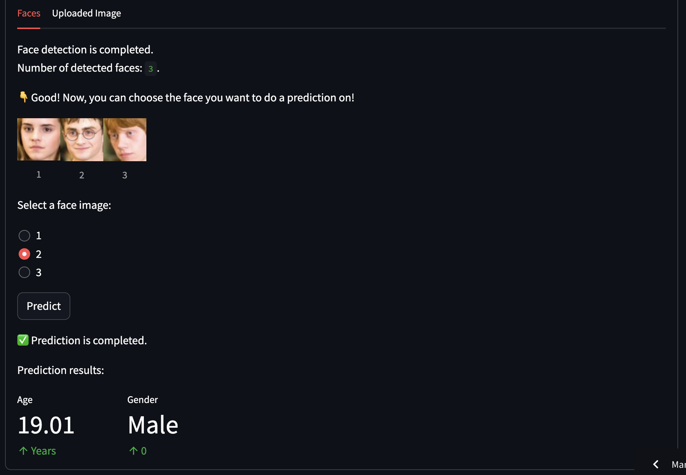

# Age and Gender Prediction App
This is a [Streamlit](https://streamlit.io/) web app where you can upload a photo of yourself and see how the computer interprets your facial features!

 👈 Find the app here!

---
**Age and Gender Prediction App** is a machine learning powered web app that allows you to select preferable model 
checkpoints based on the images you want to perform the age and gender predictions on. 

Check the details about the datasets used to train the checkpoints and select the most suitable one from `AgeDB`, `AFAD` and `CACD`.

---
Upload an image and wait while the faces are detected!

---
You are free to choose one of the detected faces to perform a prediction!

---
Check how accurate the age and gender predictions of the model and feel free to share any ideas you may have! 
If you are interested in the implementation of this deep learning model, please check out 
[here](https://github.com/SeoulTech-HCIRLab/Relative-Age-Position-Learning.git). 

If you find this app code helpful, please give a ⭐️ to the repo, so you can find it easily later!
